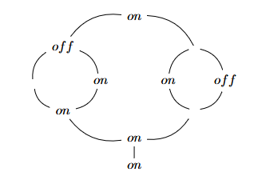
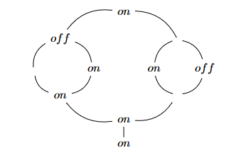
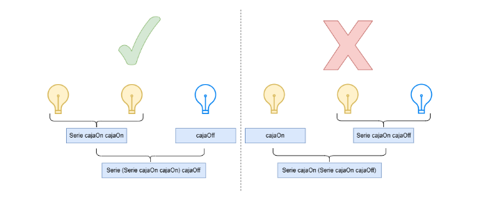

# Trabajo Práctico 1 — Programación Funcional

**Paradigmas de Lenguajes de Programación**

Único cuatrimestre de 2026

**Fecha de entrega:** 15 de Septiembre

## Control de circuitos eléctricos

Los circuitos presentes en una edificación pueden ser tan simples como una lamparita, o una compleja red de circuitos en serie y en paralelo. En nuestro caso, nos podemos encontrar con esto mismo:

- **Bombilla**: una simple lamparita, puede estar prendida o apagada.
- **Caja**: el circuito más elemental que consiste únicamente en una caja. Puede tener una bombilla o estar vacía.
- **Serie**: un circuito compuesto de dos circuitos en serie.
- **Paralelo**: un circuito que parte de una caja y se divide en dos circuitos que luego se vuelven a unir en otra caja.

Se cuenta con las siguientes definiciones de tipos y expresiones:

```haskell
data Caja = Bombilla Bool | Nada
  deriving Eq

data Circuito = Caja Caja
              | Serie Circuito Circuito
              | Paralelo Caja Circuito Circuito Caja
  deriving Eq

on = Bombilla True
off = Bombilla False
cajaOn = Caja on
cajaOff = Caja off
cajaNada = Caja Nada
```
Por ejemplo, el siguiente circuito



se define como:

```haskell
Serie
  ( Paralelo
      on
      (Paralelo off cajaNada cajaOn on)
      (Paralelo Nada cajaOn cajaOff Nada)
      on
  )
  cajaOn
```

---

## Ejercicio 1

Definir y dar el tipo del esquema de recursión primitiva sobre `Circuito`. **Este es el único ejercicio en el que se permite utilizar recursión explícita.**

## Ejercicio 2

Definir y dar el tipo del esquema de recursión estructural sobre `Circuito`. Se debe reutilizar el esquema definido en el ejercicio anterior.

## Ejercicio 3

Definir la función `invertido :: Circuito -> Circuito` que dado un circuito describe una versión invertida del mismo (en la que todo el cableado cambia de dirección).
Por ejemplo, si se le aplica la función al circuito de ejemplo queda:


```haskell
Serie
  cajaOn
  ( Paralelo
      on
      (Paralelo Nada cajaOff cajaOn Nada)
      (Paralelo on cajaOn cajaNada off)
      on
  )
```

## Ejercicio 4

Definir la función `hayCaminoIluminado :: Circuito -> Bool` que dado un circuito indica si en el mismo existe un camino desde la primera hasta la última caja pasando únicamente por cajas con bombillas encendidas. Entendemos por "camino" en un circuito una secuencia de cajas (ya sea que tengan bombilla o no) de forma que cada una esté conectada inmediatamente a la siguiente sin haber cajas intermedias.

## Ejercicio 5

Definir la función `cantidadPrendidas :: Circuito -> Int` que dado un circuito describe la cantidad de luces prendidas que tiene.

## Ejercicio 6

Definir la función `cajasDeCircuito :: Circuito -> [Caja]` que dado un circuito describe una lista con todas sus cajas en orden de aparición. En el caso de los circuitos paralelos, deben aparecer primero todas las cajas del circuito izquierdo (siguiendo el mismo orden) y luego las del derecho.

Por ejemplo, si se le aplica la función al circuito de ejemplo el resultado sería:

```haskell
[on, off, Nada, on, on, Nada, on, off, Nada, on, on]
```

## Ejercicio 7

Mientras escribíamos el TP nos dimos cuenta de que un circuito con varias cajas en serie se puede representar de varias formas distintas. Por ejemplo, los circuitos `Serie (Serie cajaOn cajaOff) cajaOn` y `Serie cajaOn (Serie cajaOff cajaOn)` describen el mismo circuito (que consta de 3 cajas en serie).

Definir la función `esCircuitoProlijo :: Circuito -> Bool` que dado un circuito indica si el mismo es prolijo. Decimos que un circuito es prolijo si para cada subcircuito que es `Serie`, el segundo subcircuito del mismo no es `Serie`.

Por ejemplo, el circuito `Serie (Serie cajaOn cajaOff) cajaOn` es prolijo, pero el circuito `Serie cajaOn (Serie cajaOff cajaOn)` no. La imagen de la figura 1 muestra cómo se verían gráficamente los ejemplos.



> **Figura 1:** Ejemplos de circuitos que representan el mismo circuito. El de la izquierda es prolijo pero el de la derecha no.

## Ejercicio 8

Definir la función `circuitoEmprolijado :: Circuito -> Circuito` que dado un circuito describe uno equivalente pero prolijo.

Por ejemplo, si se le aplica la función a `Serie cajaOn (Serie cajaOff cajaOn)` el resultado debería ser `Serie (Serie cajaOn cajaOff) cajaOn`.

> **Nota:** Para testear este ejercicio conviene modificar la línea 18 del archivo `tp1.hs` de `show = showDeCircuito` a `show = showDeCircuitoConEstructura`. De esa forma, podrán distinguir la estructura de los circuitos en serie (el `show` convencional de circuitos no distingue entre dos circuitos en serie con estructura distinta, por lo que podría ser difícil interpretar correctamente la salida del test).

## Ejercicio 9

Definir la función `tienenLaMismaEstructura :: Circuito -> Circuito -> Bool` que dados dos circuitos prolijos indica si tienen la misma estructura, más allá de lo que haya en las cajas.

## Ejercicio 10

Suponiendo que está definida la función `resistenciaCircuito :: Circuito -> Float` que describe la resistencia de una caja en Ohms, definir la función `subCircuitoMásResistente :: Circuito -> Circuito` que dado un circuito describe su subcircuito más resistente. Tener en cuenta que todo circuito es subcircuito de sí mismo.

## Ejercicio 11

Demostrar la siguiente propiedad:

```haskell
alternado . alternado = id
```

Para este ejercicio se cuenta con las siguientes definiciones:

```haskell
alternado :: Circuito -> Circuito
{AC} alternado (Caja caja) = Caja (cajaAlternada caja)
{AS} alternado (Serie ci cf) = Serie (alternado ci) (alternado cf)
{AP} alternado (Paralelo ce ci cd cs) =
       Paralelo (cajaAlternada ce) (alternado ci) (alternado cd) (cajaAlternada cs)

cajaAlternada :: Caja -> Caja
{CAN} cajaAlternada Nada = Nada
{CAB} cajaAlternada (Bombilla booleano) = Bombilla (not booleano)

(.) :: (b -> c) -> (a -> b) -> a -> c
{C} (f . g) x = f (g x)

id :: a -> a
{I} id x = x

not :: Bool -> Bool
{NT} not True = False
{NF} not False = True
```

Tener en cuenta que:

- Todos los pasos de la demostración deben estar debidamente justificados usando las herramientas que vimos en clase.
- No se pueden asumir demostradas propiedades sobre booleanos ni enteros.
- Se pueden definir y demostrar lemas auxiliares.

---

## Pautas de Entrega

Se debe entregar a través del campus un único archivo llamado **"tp1.zip"** conteniendo el código con la implementación de las funciones pedidas (**"TP1.hs"** y **"tests.hs"**). Para eso, ya se encuentra disponible la entrega "TP1 - Programación Funcional" en la solapa "TPs" (configurada de forma grupal para que sólo una persona haga la entrega en nombre del grupo).

El código entregado debe incluir tests que permitan probar las funciones definidas. El código **debe** poder ser ejecutado en Haskell2010. No es necesario entregar un informe sobre el trabajo, alcanza con que el código esté **adecuadamente** comentado (son comentarios adecuados los que ayudan a entender lo que no es evidente o explican decisiones tomadas; no son adecuadas las traducciones al castellano del código).

Los objetivos a evaluar son:

- **Corrección.**
- **Declaratividad.**
- **Prolijidad**: evitar repetir código innecesariamente y usar adecuadamente las funciones previamente definidas (tener en cuenta tanto las funciones definidas en el enunciado como las definidas por ustedes mismos).
- **Uso adecuado de funciones de alto orden, currificación y esquemas de recursión**: Es necesario para los ejercicios que usen las funciones que vimos en clase y aquellas disponibles en la sección Útil del campus y aprovecharlas, por ejemplo, usar `zip`, `map`, `filter`, `take`, `takeWhile`, `dropWhile`, `foldr`, `foldl`, listas por comprensión, etc, cuando sea necesario y no volver a implementarlas.
- Salvo donde se indique lo contrario, **no se permite utilizar recursión explícita**, dado que la idea del TP es aprender a aprovechar las características enumeradas en el ítem anterior. Se permite utilizar listas por comprensión y esquemas de recursión definidos en el preludio de Haskell y los módulos `Prelude`, `List`, `Maybe`, `Data.Char`, `Data.List`, `Data.Map`, `Data.Function`, `Data.Maybe`, `Data.Ord` y `Data.Tuple`. Las sugerencias de los ejercicios pueden ayudar, pero no es obligatorio seguirlas. Pueden escribirse todas las funciones auxiliares que se requieran, pero estas no pueden usar recursión explícita (ni mutua, ni simulada con `fix`).
- **Tests**: cada ejercicio debe contar con uno o más ejemplos que muestren que exhibe la funcionalidad solicitada. Para esto se recomienda la codificación de tests usando el paquete [HUnit](https://hackage.haskell.org/package/HUnit). El esqueleto provisto incluye algunos ejemplos de cómo utilizarlo para definir casos de test para cada ejercicio.

Para ejecutar los tests ejecutar `ghci tests.hs` y dentro del intérprete ejecutar `main`.

> **Importante:** Se espera que la elaboración de este trabajo sea 100% de los estudiantes del grupo que realiza la entrega. Así que, más allá de que pueden tomar información de lo visto en las clases o consultar información en la documentación de Haskell o disponible en Internet, no se podrán utilizar herramientas para generar parcial o totalmente en forma automática la resolución del TP (e.g., chat-GPT, copilot, etc). En caso de detectarse esto, el trabajo será considerado como un plagio, por lo que será gestionado de la misma forma que se resuelven las copias en los parciales u otras instancias de evaluación.

---

## Referencias del lenguaje Haskell

Como principales referencias del lenguaje de programación Haskell, mencionaremos:

- **The Haskell 2010 Language Report**: el reporte oficial de la versión del lenguaje Haskell al 2010, disponible online en <https://www.haskell.org/onlinereport/haskell2010>.
- **Learn You a Haskell for Great Good!**: libro accesible, para todas las edades, cubriendo todos los aspectos del lenguaje, notoriamente ilustrado, disponible online en <https://learnyouahaskell.com/chapters>.
- **Real World Haskell**: libro apuntado a zanjar la brecha de aplicación de Haskell, enfocándose principalmente en la utilización de estructuras de datos funcionales en la "vida real", disponible online en <https://book.realworldhaskell.org/read>.
- **Hoogle**: buscador que acepta tanto nombres de funciones y módulos, como signaturas y tipos parciales, online en <https://www.haskell.org/hoogle>.